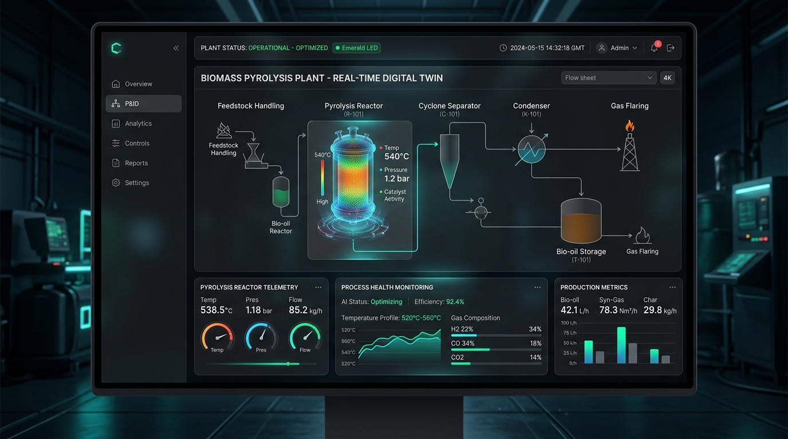
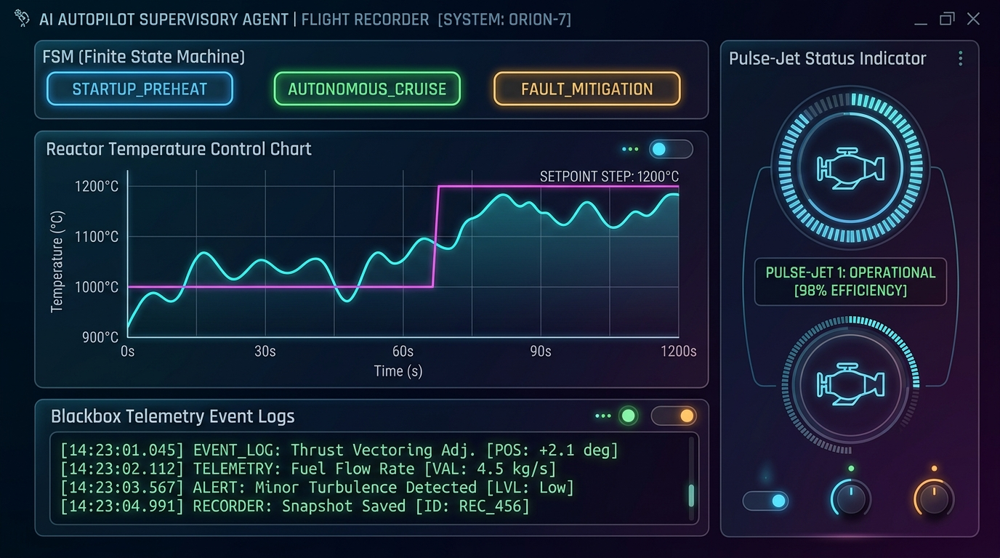
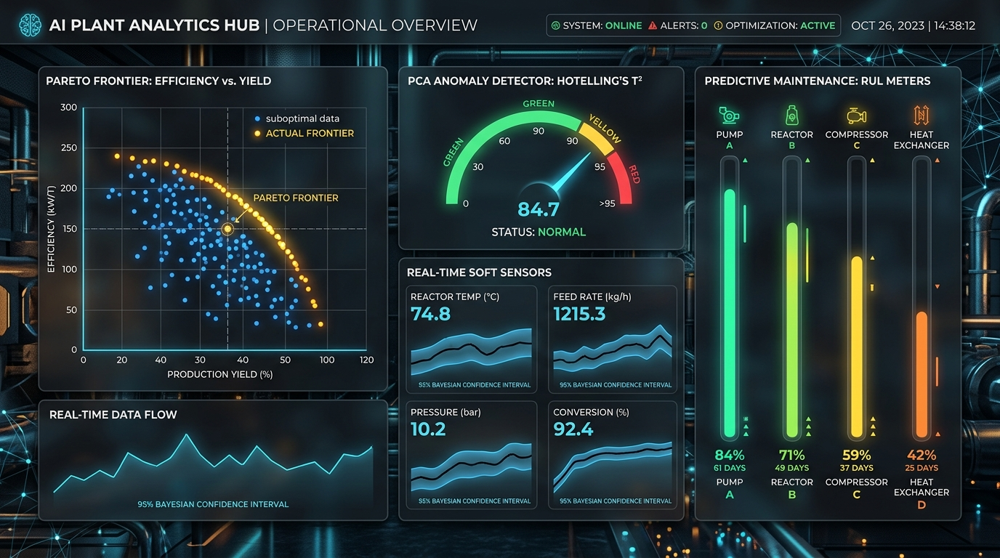
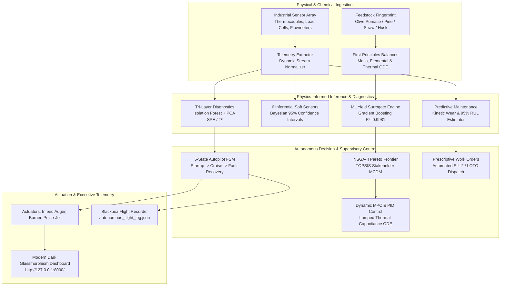

# 🌿 AI-Integrated Biomass Recycling & Conversion Plant Digital Twin (V2.2)

<div align="center">

[](https://github.com/cagataykilicc/ai-biomass-plant/actions/workflows/ci.yml)
[](https://www.python.org/downloads/)
[](src/iot/)
[-2496ED.svg?logo=docker&logoColor=white)](Dockerfile)
[](http://127.0.0.1:8000/docs)
[](https://git-lfs.com)
[](https://github.com/cagataykilicc/ai-biomass-plant)
[](https://github.com/cagataykilicc/ai-biomass-plant)
[](https://github.com/cagataykilicc/ai-biomass-plant)
[](https://github.com/cagataykilicc/ai-biomass-plant)
[](https://github.com/cagataykilicc/ai-biomass-plant)
[](http://127.0.0.1:8000/)
[](https://github.com/cagataykilicc/ai-biomass-plant/actions)
[](LICENSE)
[](https://github.com/cagataykilicc)

**An industrial-grade, physics-informed digital twin, autonomous AI autopilot, and real-time operations platform for thermochemical biomass pyrolysis plants.**

[Overview](#-1-system-overview) • [Screenshots](#-2-interactive-web-cockpit--screenshots) • [Architecture](#-3-system-architecture) • [Core Modules](#-4-the-8-operational-modules) • [Quick Start](#-5-quick-start--installation) • [Docker](#-6-docker-deployment) • [REST & Swagger API](#-7-rest-api--swagger-documentation) • [Tutorials](#-8-interactive-jupyter-tutorial-suite) • [Industrial IoT](#-9-industrial-iot--edge-gateways) • [Roadmap](ROADMAP.md) • [Author](#-11-author--maintainer)

</div>

---

<div align="center">
  
</div>

---

## 🔬 1. System Overview

**BIOPLANT AI (V2.0)** bridges first-principles chemical engineering with modern physics-informed artificial intelligence, Model Predictive Control (MPC), and autonomous supervisory operations:

* **Closed-Loop Autonomous Supervisory Control (V2.0)**: Governed by a 5-State Finite State Machine (`STARTUP_PREHEAT`, `AUTONOMOUS_CRUISE`, `DISTURBANCE_ADAPTATION`, `FAULT_MITIGATION`, `EMERGENCY_SAFE_PARK`) with self-healing nitrogen pulse-jet blowback to resolve cyclone clogs without tripping the reactor.
* **Blackbox Flight Telemetry & Historian**: Ring-buffer flight logger storing state vectors, control efforts, and safety alarms into structured JSON reports (`reports/autonomous_flight_log.json`).
* **Physics-Constrained ML Yield Surrogates**: Gradient Boosting, Random Forest, Extra Trees, and Multilayer Perceptrons enforcing strict elemental conservation ($C, H, O, N, S$) and energy balances ($R^2 = 0.9981$).
* **Inferential Virtual Soft Sensors (95% UQ)**: Real-time Bayesian Gaussian Process regressors estimating unmeasured Bio-Oil TAN, Moisture, Syngas LHV, and Thermal Self-Sufficiency Index (TSI).
* **Techno-Economic Assessment & Carbon Accounting**: Guthrie Factorial TCI ($TCI = \$609,840$), 20-Year Discounted Cash Flow ($NPV = +\$657,833$, $IRR = 24.88\%$, $LCOB = \$0.3534/\text{kg}$), and ISO 14040/14044 Net Carbon Negative biochar permanence ($-40.88\text{ g CO}_2\text{eq/MJ}$).
* **Predictive Maintenance & Fleet Degradation**: Wear kinetics (Archard erosion, spalling) predicting Remaining Useful Life (RUL) with prescriptive Lockout/Tagout (LOTO) work orders.

---

## 📸 2. Interactive Web Cockpit & Screenshots

<div align="center">

### Autonomous Autopilot Cockpit & Flight Director


### Advanced Analytics: Multi-Objective Pareto & Anomaly Diagnostics


</div>

---

## 🏗️ 3. System Architecture



---

## ⚙️ 4. The 8 Operational Modules

| # | Operational Module | Key Technology | Core Engineering Value |
| :-: | :--- | :--- | :--- |
| **1** | **Process Flowsheet & Control Room** | Thermodynamic First-Principles | Live animated P&ID flowsheet, mass & elemental closures, and energy self-sufficiency gauge ($TSI$). |
| **2** | **Inferential Soft Sensor Suite** | Bayesian 95% Uncertainty Regressors | 6 real-time virtual sensors estimating Bio-Oil TAN, Moisture, HHV, Syngas LHV, Yield, and TSI. |
| **3** | **Multiobjective Optimization** | NSGA-II & TOPSIS Decision Maker | 2D Pareto frontier trading off Yield, Biochar Carbon, and Gross Profit with stakeholder ranking. |
| **4** | **Tri-Layer Anomaly Diagnostics** | Isolation Forest & PCA ($Q$ & $T^2$) | Fault detection, residual checking, and automated NFPA-86/SIL-2 safety interlocks. |
| **5** | **Predictive Maintenance & Fleet RUL** | Physics-Informed Wear Kinetics | Fleet wear degradation modeling (Archard, refractory spalling) with prescriptive work orders. |
| **6** | **Dynamic Process Control & MPC** | Discrete PID & Multi-Horizon MPC | Lumped thermal capacitance ODE, setpoint step tracking, and aggressive feed moisture rejection. |
| **7** | **Techno-Economics & LCA Carbon** | Guthrie Factorial TCI & 20-Yr DCF | $NPV = +\$657\text{k}$, $IRR = 24.88\%$, $LCOB = \$0.353/\text{kg}$, Net Carbon Negative ($-40.88\text{ g CO}_2\text{e/MJ}$). |
| **8** | **Autonomous Autopilot Cockpit** | 5-State Supervisory FSM | Closed-loop autonomous flight director, self-healing pulse-jets, and blackbox telemetry log. |

---

## 🚀 5. Quick Start & Installation

### Prerequisites & Git LFS Setup
> [!IMPORTANT]
> **Git LFS Required:** Pretrained ML models, soft sensors, and anomaly diagnostic checkpoints under `models/checkpoints/` are version-controlled with [Git LFS](https://git-lfs.com). Ensure Git LFS is installed before cloning.

```bash
# 1. Install and initialize Git LFS
git lfs install

# 2. Clone repository
git clone https://github.com/cagataykilicc/ai-biomass-plant.git
cd ai-biomass-plant

# 3. Pull LFS binary model checkpoints
git lfs pull

# 4. Install Python dependencies in editable mode
pip install -e .[dev]
```

### Launching the Web Digital Twin Dashboard
```bash
# Start the web server and open the browser
python -m src.web.run_server --port 8000 --open-browser
```
Access the interactive digital twin cockpit at **`http://127.0.0.1:8000/`**.

### Executing Autonomous Flight Qualification
```bash
# Run the 4-hour multi-phase autonomous stress test mission
python -m src.autonomous.run_autopilot --mission
```

### Running Automated Test Suite (105 Tests)
```bash
pytest tests/ -q
```

---

## 🐳 6. Docker Deployment

Deploy the digital twin platform instantly in a hardened, non-root Linux container:

```bash
# Option A: Run with Docker Compose (Recommended)
docker compose up -d

# Option B: Build and run with Docker CLI
docker build -t cagataykilicc/bioplant-ai:2.1.0 .
docker run -d -p 8000:8000 --name bioplant-twin cagataykilicc/bioplant-ai:2.1.0
```

Access the containerized web control room at **`http://127.0.0.1:8000/`**.

---

## 📡 7. REST API & Swagger Documentation

The platform provides a secure zero-dependency multithreaded REST server with built-in interactive OpenAPI 3.0 interfaces:

* **Interactive Swagger UI**: **[http://127.0.0.1:8000/docs](http://127.0.0.1:8000/docs)**
* **Interactive ReDoc**: **[http://127.0.0.1:8000/redoc](http://127.0.0.1:8000/redoc)**
* **Raw OpenAPI 3.0 JSON**: **[http://127.0.0.1:8000/openapi.json](http://127.0.0.1:8000/openapi.json)**

| Method | Route | Description |
| :--- | :--- | :--- |
| **`GET`** | **`/`** | Serves the single-page Dark Glassmorphism Web GUI application |
| **`GET`** | **`/docs`** | Interactive OpenAPI Swagger UI 5.x documentation |
| **`GET`** | **`/redoc`** | ReDoc responsive API documentation |
| **`GET`** | **`/openapi.json`** | Machine-readable OpenAPI 3.0.3 specification JSON |
| **`GET`** | **`/api/status`** | System health status, version `2.2.0`, and active module availability |
| **`GET`** | **`/api/feedstocks`** | Proximate and ultimate analysis catalog (Olive Pomace, Pine, Straw, Husk) |
| **`POST`** | **`/api/simulate`** | Executes digital twin flowsheet simulation (Deterministic or ML) |
| **`POST`** | **`/api/autopilot/step`** | Advances closed-loop autonomous autopilot FSM by one step |
| **`POST`** | **`/api/autopilot/mission`** | Executes full 4-hour qualification stress test mission |
| **`POST`** | **`/api/economics`** | Runs 20-yr DCF NPV/IRR/LCOB and ISO 14040/14044 LCA carbon metrics |
| **`POST`** | **`/api/control`** | Dynamic closed-loop response simulation (MPC / PID / Open-Loop) |
| **`POST`** | **`/api/soft-sensors`** | Extracts telemetry and evaluates 6 virtual soft sensors (95% UQ) |
| **`POST`** | **`/api/optimize`** | Solves single-objective or multiobjective Pareto optimization |
| **`POST`** | **`/api/diagnostics`** | Injects equipment faults and returns tri-layer anomaly scores & alarms |
| **`POST`** | **`/api/maintenance`** | Computes asset wear, 95% RUL, and dispatches prescriptive work orders |
| **`GET`** | **`/api/iot/status`** | Operational status of Modbus TCP, MQTT Sparkplug B, OPC-UA, and HIL bridges |
| **`GET/POST`** | **`/api/iot/modbus/read`** | Exports full Modbus register table (Inputs 30001+, Holdings 40001+, Coils 00001+) |
| **`POST`** | **`/api/iot/modbus/write`** | Writes 16-bit word to Holding Register or boolean state to Coil |
| **`POST`** | **`/api/iot/mqtt/publish`** | Publishes Sparkplug B payload (`DBIRTH`, `DDATA`) or handles `NCMD` commands |
| **`POST`** | **`/api/iot/hil/step`** | Simulates 4-20mA current loop ADC conversion with NAMUR NE 43 fault injection |

### Example API Request (curl)
```bash
curl -X POST http://127.0.0.1:8000/api/simulate \
  -H "Content-Type: application/json" \
  -H "X-API-Key: bioplant-default-dev-key" \
  -d '{
    "feedstock": "olive_pomace",
    "reactor_temp_c": 500.0,
    "feed_rate_kg_h": 100.0,
    "yield_mode": "ml"
  }'
```

---

## 📓 8. Interactive Jupyter Tutorial Suite

Explore step-by-step interactive Jupyter notebooks located in [`notebooks/`](notebooks/):

1. **[`01_quickstart_and_thermodynamics.ipynb`](notebooks/01_quickstart_and_thermodynamics.ipynb)**: First-principles flowsheet simulation, multi-feedstock chemical fingerprints, and mass/energy conservation analysis.
2. **[`02_surrogate_models_and_soft_sensors.ipynb`](notebooks/02_surrogate_models_and_soft_sensors.ipynb)**: Physics-constrained ML surrogate predictions and 6 Bayesian soft sensors with 95% Confidence Intervals.
3. **[`03_pareto_optimization_and_tea_lca.ipynb`](notebooks/03_pareto_optimization_and_tea_lca.ipynb)**: NSGA-II 2D Pareto frontiers, TOPSIS MCDM stakeholder ranking, 20-yr DCF valuation, and ISO 14040 carbon negative accounting.
4. **[`04_autonomous_autopilot_flight_telemetry.ipynb`](notebooks/04_autonomous_autopilot_flight_telemetry.ipynb)**: Running the 4-hour autonomous qualification mission and parsing blackbox flight logs with trajectory charts.

---

## 🌐 9. Industrial IoT & Edge Gateways (Version 2.2)

BIOPLANT AI integrates standard industrial edge communication protocols to interface seamlessly with physical SCADA/DCS systems and PLCs:

* **Modbus TCP Gateway ([`src/iot/modbus_gateway.py`](src/iot/modbus_gateway.py))**:
  - Exposes 16-bit Input Registers (`30001-30010`) for live temperatures, pressures, feed rates, TSI, and RUL.
  - Discrete Inputs (`10001-10008`) for alarms and autonomous cruise state.
  - Holding Registers (`40001-40005`) for supervisory setpoint actuation.
* **MQTT Sparkplug B Bridge ([`src/iot/mqtt_bridge.py`](src/iot/mqtt_bridge.py))**:
  - Implements Eclipse Sparkplug B specification (`spBv1.0/BiomassRecycling/DDATA/...`) with timestamped metric arrays and sequence numbering.
* **OPC-UA Address Space ([`src/iot/opcua_bridge.py`](src/iot/opcua_bridge.py))**:
  - Hierarchical IEC 62541 information model (`Root -> Objects -> BioPlant -> ProcessData / Alarms / Setpoints / Methods`).
* **Hardware-in-the-Loop Simulator ([`src/iot/hil_simulator.py`](src/iot/hil_simulator.py))**:
  - Emulates physical 4.0 - 20.0 mA transmitter current loops with 12-bit ADC quantization, analog noise, and NAMUR NE 43 loop fault diagnostics (Open Loop `< 3.6 mA`, Short Circuit `> 21.0 mA`).

---

## 🗺️ 10. Product & Engineering Roadmap

Detailed milestone planning, architectural specifications, and release timelines are documented in [**ROADMAP.md**](ROADMAP.md):

* **`V2.1` (Completed)**: Dockerization & Compose, Interactive OpenAPI Swagger `/docs`, ReDoc, and 4-Part Jupyter Tutorial Suite.
* **`V2.2` (Completed)**: Industrial IoT protocol bridges (Modbus TCP, MQTT Sparkplug B, OPC-UA), Hardware-in-the-Loop (HIL), and real-time register monitoring.
* **`V2.5` (Fleet & Market AI)**: Multi-reactor regional fleet dispatching, dynamic CORC carbon credit arbitrage, and hybrid renewable grid integration.
* **`V3.0` (Next-Gen AI & Spatial Twin)**: Deep Reinforcement Learning (PPO/SAC Gym), Three.js 3D WebGL Holographic Spatial Twin, and Generative AI SCADA Operator Copilot.

---

## 👨‍💻 11. Author & Maintainer

<table align="center">
  <tr>
    <td align="center">
      <a href="https://github.com/cagataykilicc">
        
        <br />
        <sub><b>Çağatay Kılıç</b></sub>
      </a>
      <br />
      <sub>Creator & Lead Engineer</sub>
      <br />
      <a href="https://github.com/cagataykilicc" title="GitHub">
        
      </a>
    </td>
  </tr>
</table>

* **GitHub**: [@cagataykilicc](https://github.com/cagataykilicc)
* **Project Repository**: [https://github.com/cagataykilicc/ai-biomass-plant](https://github.com/cagataykilicc/ai-biomass-plant)

---

## 📜 12. License

This project is licensed under the terms of the **MIT License**. See the [LICENSE](LICENSE) file for complete details.
