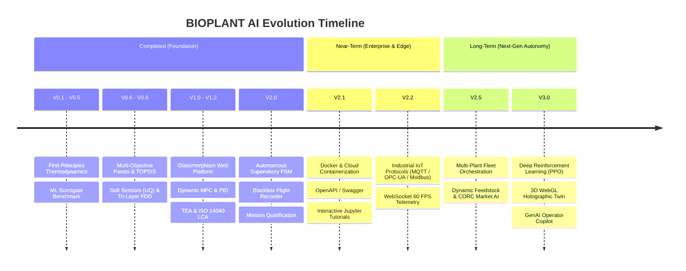

# 🗺️ BIOPLANT AI — Product & Engineering Development Roadmap

This document outlines the strategic engineering roadmap for the **BIOPLANT AI Digital Twin & Autonomous Operations Platform**, charting the trajectory from initial chemical modeling to enterprise IoT, multi-plant fleet optimization, and next-generation 3D WebGL digital twins.

---

## 📍 Roadmap Summary & Version Timeline



---

## ✅ Completed Milestones (V0.1 – V2.0)

<details open>
<summary><b>View Completed Milestones Details</b></summary>

### 🔹 V0.1 – V0.5: Thermodynamic Foundation & Machine Learning Surrogates
- [x] **V0.1**: Deterministic mass and elemental balances across 4 feedstocks (Olive Pomace, Pine Sawdust, Wheat Straw, Rice Husk).
- [x] **V0.2**: Heat integration and Thermal Self-Sufficiency Index ($TSI$) dynamic balance.
- [x] **V0.3**: Experimental literature data synthesis and Latin Hypercube sampling engine.
- [x] **V0.4**: Physics-constrained ML yield prediction enforcing strict $C, H, O, N, S$ conservation.
- [x] **V0.5**: Multi-model benchmark suite (Gradient Boosting champion with $R^2 = 0.9981$).

### 🔹 V0.6 – V0.9: Optimization, Soft Sensors & Diagnostics
- [x] **V0.6**: Multi-objective NSGA-II Pareto optimization with TOPSIS stakeholder multi-criteria ranking.
- [x] **V0.7**: 6 real-time Bayesian Gaussian Process soft sensors with 95% Confidence Intervals.
- [x] **V0.8**: Tri-layer fault detection (Residuals, Isolation Forest, PCA Hotelling’s $T^2$ & $Q$-statistic) with SIL-2/NFPA-86 automated interlocks.
- [x] **V0.9**: Physics-informed degradation kinematics (Archard wear, liner spalling) predicting asset RUL and dispatching LOTO work orders.

### 🔹 V1.0 – V1.2: Interactive Platform, Dynamic Control & Techno-Economics
- [x] **V1.0**: Zero-dependency multithreaded REST API server and modern dark glassmorphism web control room.
- [x] **V1.1**: Dynamic closed-loop process control simulation (lumped thermal capacitance ODE with discrete PID and MPC).
- [x] **V1.2**: Guthrie Factorial Total Capital Investment ($TCI = \$609\text{k}$), 20-Year DCF ($NPV = +\$657\text{k}, IRR = 24.88\%$), and ISO 14040/14044 Life Cycle Assessment (Net Carbon Negative permanent biochar sequestration).

### 🔹 V2.0: Fully Autonomous Supervisory Autopilot
- [x] **V2.0**: 5-State Autonomous Supervisory FSM (`STARTUP_PREHEAT`, `AUTONOMOUS_CRUISE`, `DISTURBANCE_ADAPTATION`, `FAULT_MITIGATION`, `EMERGENCY_SAFE_PARK`).
- [x] **V2.0**: Self-healing nitrogen pulse-jet blowback clearing cyclone blockages in 40s without plant trip.
- [x] **V2.0**: Blackbox flight recorder logging high-resolution state trajectories into `reports/autonomous_flight_log.json`.
- [x] **V2.0**: 4-hour multi-phase mission qualification stress test with 100% mission success rate.
- [x] **Security & CI**: Fail-closed API-key authorization, input bounds validation, path traversal protection, Git LFS tracking, and GitHub Actions CI workflow (102/102 tests passed).

### 🔹 V2.1: Enterprise Deployment & Developer Experience
- [x] **Dockerization**: Multi-stage production `Dockerfile` (Python 3.11-slim) with unprivileged non-root user and automated container healthcheck probes.
- [x] **Docker Compose**: `docker-compose.yml` service with persistent `./reports` volume mount.
- [x] **OpenAPI 3.0.3 & Swagger UI**: Auto-generated interactive API documentation at `/docs` (Swagger UI), `/redoc`, and `/openapi.json`.
- [x] **Jupyter Tutorial Suite**: 4 interactive `.ipynb` tutorials covering thermodynamics, ML surrogates, Pareto optimization, and 4-hour autopilot telemetry.
- [x] **Test Coverage**: 105 automated unit and integration tests passing (`100% pass rate`).

### 🔹 V2.2: Industrial IoT, Edge Protocols & Hardware-in-the-Loop
- [x] **Modbus TCP Gateway**: 16-bit Input/Holding register mapping with scaled conversions and Discrete Input / Coil control.
- [x] **MQTT Sparkplug B Bridge**: Edge payload generation (`DBIRTH`, `DDATA`, `NCMD`) over `spBv1.0` topic hierarchy.
- [x] **OPC-UA Address Space**: IEC 62541 hierarchical information model with 14 process and alarm nodes.
- [x] **HIL Hardware Simulator**: 4.0 - 20.0 mA transmitter current loop scaling, 12-bit ADC quantization, and NAMUR NE 43 circuit fault injection.
- [x] **Test Coverage**: 110 automated unit and integration tests passing (`100% pass rate`).

</details>

---

## 🚀 Future Development Roadmap (V2.5 – V3.0+)

```
  ┌────────────────────────────────────────────────────────────────────────┐
  │                           PHASED ROADMAP                               │
  ├───────────────────────────────────┬────────────────────────────────────┤
  │   V2.5 Fleet & Grid AI (Q2)       │   V3.0 Next-Gen Twin (Q3-Q4)       │
  │   - Multi-Plant Dispatch          │   - Deep RL (PPO/SAC Transients)   │
  │   - Dynamic CORC Market Trading   │   - 3D WebGL Holographic (Three.js)│
  │   - Hybrid Renewable Grid Storage │   - Generative AI SCADA Copilot    │
  └───────────────────────────────────┴────────────────────────────────────┘
```

---

### 🌐 Phase 3: Multi-Plant Fleet & Carbon Market Optimization (Version 2.5)
**Goal:** Scale from a single plant to regional multi-reactor decentralized fleet management and carbon trading.

- [ ] **Decentralized Multi-Reactor Fleet Orchestrator**:
  - Centralized dashboard coordinating multiple distributed pyrolysis plants across different biomass collection hubs.
  - Load balancing feed rates based on local agricultural harvest seasons (e.g., olive harvest vs. wheat harvesting).
- [ ] **Real-Time Dynamic Carbon Credit (CORC) Arbitrage**:
  - Real-time API integration with Puro.earth / Verra voluntary carbon marketplaces.
  - Autonomous setpoint optimization switching between bio-oil profit maximization and biochar permanent carbon removal maximization based on spot carbon credit pricing.
- [ ] **Hybrid Renewable Grid Integration**:
  - Model coupling with on-site Solar PV, wind turbines, and industrial thermal energy storage (TES) to minimize grid power costs during peak electricity tariff hours.

---

### 🌐 Phase 3: Multi-Plant Fleet & Carbon Market Optimization (Version 2.5)
**Goal:** Scale from a single plant to regional multi-reactor decentralized fleet management and carbon trading.

- [ ] **Decentralized Multi-Reactor Fleet Orchestrator**:
  - Centralized dashboard coordinating multiple distributed pyrolysis plants across different biomass collection hubs.
  - Load balancing feed rates based on local agricultural harvest seasons (e.g., olive harvest vs. wheat harvesting).
- [ ] **Real-Time Dynamic Carbon Credit (CORC) Arbitrage**:
  - Real-time API integration with Puro.earth / Verra voluntary carbon marketplaces.
  - Autonomous setpoint optimization switching between bio-oil profit maximization and biochar permanent carbon removal maximization based on spot carbon credit pricing.
- [ ] **Hybrid Renewable Grid Integration**:
  - Model coupling with on-site Solar PV, wind turbines, and industrial thermal energy storage (TES) to minimize grid power costs during peak electricity tariff hours.

---

### 🧠 Phase 4: Next-Generation Autonomous Digital Twin (Version 3.0)
**Goal:** State-of-the-art Deep Reinforcement Learning, 3D WebGL visualization, and Generative AI SCADA Assistant.

- [ ] **Deep Reinforcement Learning (DRL) Controller**:
  - OpenAI Gym / Gymnasium environment: `BiomassPlant-v0`.
  - Train Proximal Policy Optimization (PPO) and Soft Actor-Critic (SAC) neural policies on extreme transient scenarios (abrupt feedstock moisture surges, catalyst poisoning, feed auger clogs).
- [ ] **3D WebGL Holographic Plant Visualizer (Three.js)**:
  - 3D spatial twin rendering the fluidized bed reactor, cyclone diplegs, condenser tubes, and combustor flame with real-time temperature gradient heatmaps and particle effect simulations.
- [ ] **Generative AI Plant Operations Copilot (LLM Agent)**:
  - Natural language conversational assistant embedded into the control room.
  - Operator can ask: *"Why did the TSI drop 12% in the last 15 minutes?"* and the Copilot analyzes blackbox flight recorder telemetry, pinpoints high feedstock moisture, and recommends a specific corrective burner boost SOP.

---

## 📈 Feature Matrix & Milestone Deliverables

| Version | Target Horizon | Core Theme | Key Deliverables |
| :---: | :---: | :--- | :--- |
| **`V2.0`** | **Current** | Full Autonomy & Validation | 5-State FSM Autopilot, Flight Recorder, Guthrie DCF & ISO LCA, 102 Tests, Git LFS. |
| **`V2.1`** | **Near-Term** | Cloud & Developer Packaging | Docker Compose, Live Hugging Face / Render Demo, Swagger `/docs`, Jupyter Tutorials. |
| **`V2.2`** | **Q1** | Industrial IoT & Edge | MQTT Sparkplug B, OPC-UA, Modbus TCP, Sub-50ms WebSocket telemetry streaming. |
| **`V2.5`** | **Q2** | Fleet & Carbon Market AI | Multi-reactor fleet dispatch, live CORC carbon credit trading, dynamic renewable coupling. |
| **`V3.0`** | **Q3-Q4** | Next-Gen AI & 3D Spatial Twin | Deep RL (PPO/Gym), Three.js 3D Holographic Twin, GenAI Operator SCADA Copilot. |

---

## 🤝 Contribution & Feedback

Have ideas, bug reports, or feature suggestions for the roadmap?
- Open an Issue or Discussion on GitHub: **[https://github.com/cagataykilicc/ai-biomass-plant](https://github.com/cagataykilicc/ai-biomass-plant)**
- Lead Engineer: **Çağatay Kılıç** ([@cagataykilicc](https://github.com/cagataykilicc))
